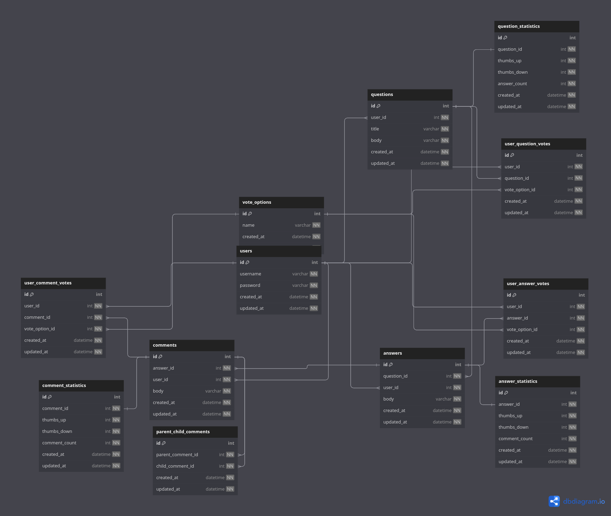

# opendiscuss

Opendiscuss is a community platform where people contribute to discuss various topics.

## User Stories

You can find user stories in the file [README-user-story.md](README-user-story.md).

## Entiry Relationship Diagram

You can view the ERD on [dbdiagram](https://dbdiagram.io/d/opendiscuss-erd-64e854c002bd1c4a5e6392d5) and [dbdocs](https://dbdocs.io/hidayathamir/opendiscuss).



## Quick Start

1. Rename `.env-example` to `.env`.

2. Run the MySQL database and the Go app using Docker Compose:

```shell
sudo docker compose up
```

To view MySQL credentials, you can refer to the [docker-compose.yml](docker-compose.yml) file.

You can check this youtube video for [Quick Start Opendiscuss](https://youtu.be/S9iGM_GFVkc?si=zawTc9gu3J-Yw99J).

## API Documentation

For API documentation, you can import the file [postman/opendiscuss.postman_collection.json](postman/opendiscuss.postman_collection.json) into your Postman.
